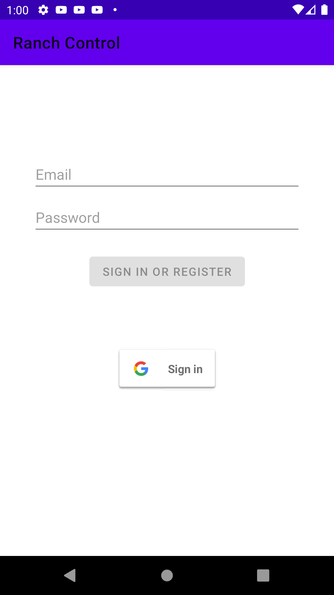
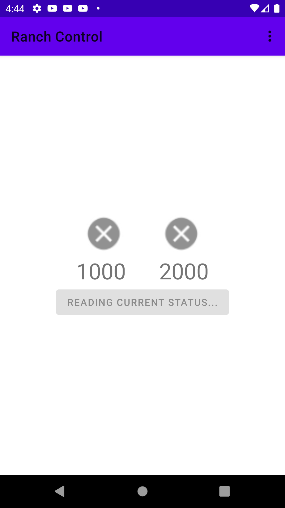
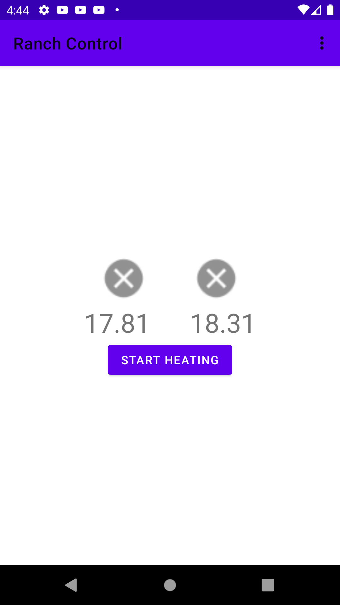
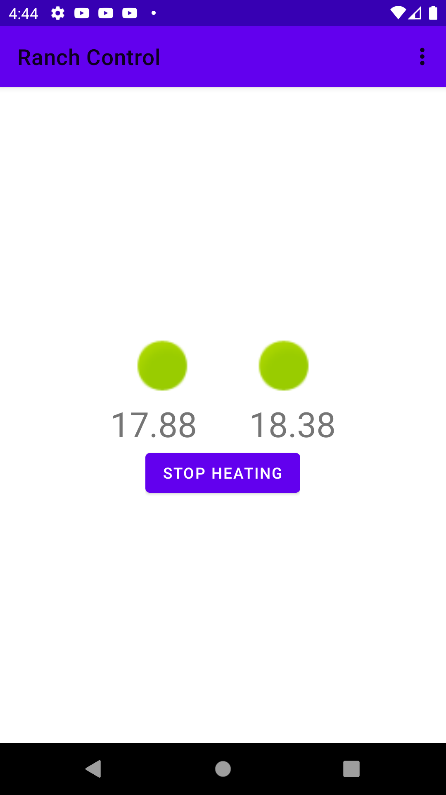

# Ranch Control

Talks to a WebSocket Server that continuously provides Ranch temperature updates.
Users can login using their Google account via Firebase, and the JWT is checked on backend for authorization.

Short demo:

    
    
    
    

